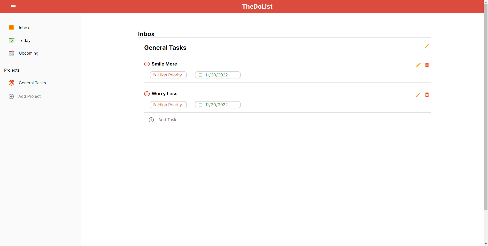

# TheDoList

This is a solution to the [Project: Todo List](https://www.theodinproject.com/lessons/node-path-javascript-todo-list). The [Odin Project](https://www.theodinproject.com/about) provides a free open source coding curriculum that can be taken entirely online. Since its inception, it has helped many students get hired as developers and has assisted countless others in learning enough programming to work on their own personal projects.

## Overview

### The challenge

Build a Todo List that does the following:

- view all projects
- view all todos in each project (probablyview all projects
  view all todos in each project (probably just the title and duedate… perhaps changing color for different priorities)
  expand a single todo to see/edit its details
  delete a todo
  just the title and duedate… - - perhaps changing color for different priorities)
- expand a single todo to see/edit its details
- delete a todo

### Screenshot

### Links

- Live Site URL: [https://theadg.github.io/admin-dashboard/]

## My Process

### Built with

- Semantic HTML5 markup
- CSS custom properties
- BEM Naming Convention
- Vanilla JS
- SASS
- Flexbox
- Webpack

### What I learned

I have learned and implemented the OOP Principles. I mainly focused on using the Single Responsibility Principle as I believe it is one of the most foundational principles that I should possess. I have also learned how to sort of "group" blocks of my code together for it to be cleaner. I have also made sure that the objects I used were not tightly coupled as they rely to heavily on each other.

### Continued development

I still have a lot more to practice since I have learned such important fundamentals that I will use through my software engineering career. I will keep trying to write clean and maintainable code. I'll make sure to always keep in mind the SOLID principles.
